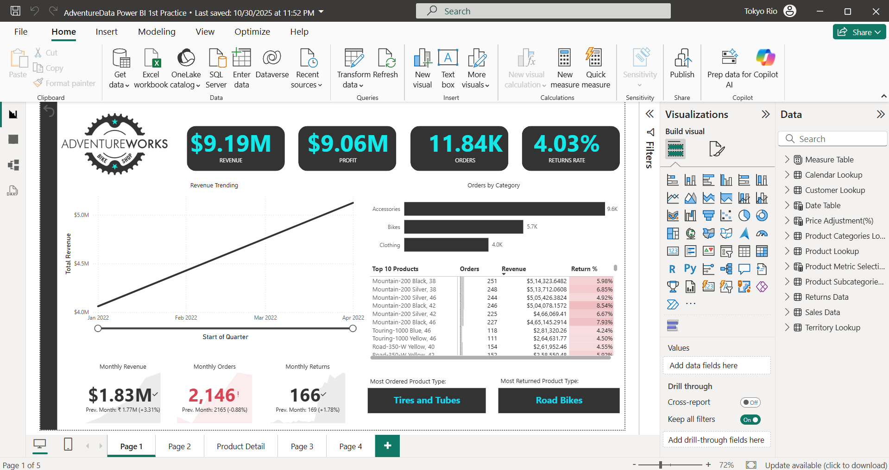
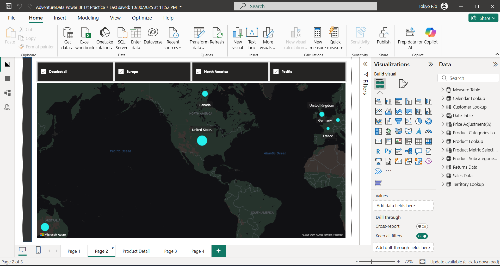
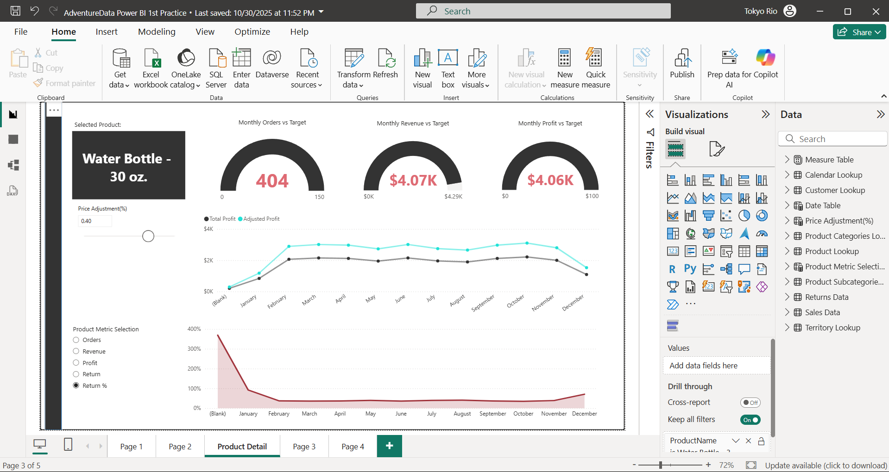
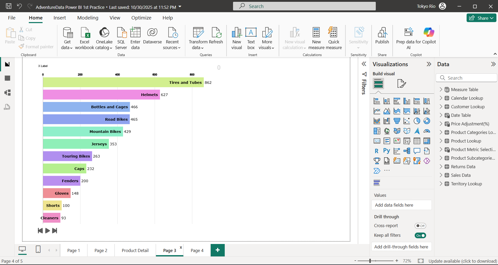

# 📊 Sales Performance Dashboard

## 📌 Project Overview
This project presents a dynamic Sales Performance Dashboard built using Power BI and SQL to transform raw transactional data into actionable business insights.  

The dashboard analyzes company sales data to identify revenue trends, regional performance, and top-performing products.

**Dataset Used:** Microsoft Adventure Works

---

## 🎯 Business Objective
- Monitor overall sales performance  
- Identify high-performing regions  
- Analyze product-level revenue contribution  
- Track profit and growth trends  
- Support data-driven business decision making  

---

## 🛠️ Tools & Technologies
- Power BI (Data Visualization & Modeling)
- SQL (Data Extraction & Analysis)
- Microsoft Adventure Works Dataset

---

## 🗂️ Data Model
The dashboard is built using a **star schema data model**, including:

- **FactInternetSales** – Sales Transactions  
- **DimProduct** – Product Details  
- **DimDate** – Date Information  
- **DimCustomer** – Customer Information  
- **DimSalesTerritory** – Regional Data  

Relationships were created between fact and dimension tables to enable efficient filtering and aggregation across multiple business dimensions.

---

## 📈 Key Performance Indicators (KPIs)
- Total Sales  
- Total Profit  
- Profit Margin %  
- Total Orders  
- Top Performing Region  
- Best Selling Product  

---

## 📊 Dashboard Features
- Interactive Filters (Year, Region, Product Category)  
- Sales Trend Analysis (Year-wise Performance)  
- Region-wise Performance Comparison  
- Top Products by Revenue  
- KPI Cards for Executive Summary  
- Clean & Business-Friendly Layout  

---

## 🖼️ Dashboard Preview

### Overview

### Sales Trend

### Region Analysis

### Top Products

---

## 📌 Key Insights
- North America generated the highest revenue contribution.  
- Sales show consistent year-over-year growth.  
- A small group of products contributes to the majority of revenue (Pareto principle observed).  
- Seasonal peaks are noticeable during Q4, indicating strong holiday demand.  

---

## 🚀 How to Use
1. Download the `.pbix` file from the `dashboard` folder.  
2. Open the file in Power BI Desktop.  
3. Explore interactive filters and visual insights.  

---

## 📌 Future Improvements
- Add forecasting using advanced DAX calculations  
- Implement drill-through reports for detailed analysis  
- Publish dashboard to Power BI Service  
- Add Row-Level Security (RLS) for role-based access  

---

## 👨‍💻 Author
M Venkateshwar Rao 
Aspiring Data Analyst | Power BI | SQL | Data Visualization
